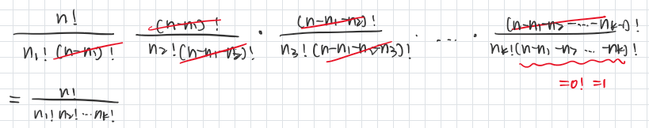

# VE401 Probabilistic Methods in Eng. 

> By TA: DONG Juechu, Mar. 2021

## RC#1 Probability Theory & Discrete Random Variables

## Classical Definition of Probability

#### Cardan's Principle

*Let A be a random outcome of an experiment that may proceed in various ways. Assume each of these ways is*
**==equally likely==**. *Then the probability P[A] of the outcome A is​*

$$
P[A]=\frac{\text { number of ways leading to outcome } A}{\text { number of ways the experiment can proceed. }}
$$

**[IMPORTANT]** *Suppose a set A of n objects is given,*

- There are $\frac{n !}{(n-k) !}$ different ways of choosing an ordered tuple of $k$ objects from $A$. Such a choice is called a **==permutation==** of $k$ objects from $A$.
- There are $\frac{n !}{k !(n-k) !}$ different ways of choosing an unordered set of $k$ objects from $A$. Such a choice is called a **==combination==** of k objects from $A$
- There are $\frac{n !}{n_{1} ! n_{2} ! \ldots n_{k} !}$ ways of partitioning $\hat{A}_{i}$ into $k$ disjoint subsets $A_{1}, \ldots, A_{k}$ whose union is $A,$ where each $\vec{a}_{i}$ has $n_{i}$ elements. This is called a **==permutation of k indistinguishable objects from A==** (deduced from the 1)

#### Sample Space

Any subset $A$ of a sample space $S$ is called an **==event==**.

Two events $A_{1}, A_{2}$ are called **==mutually exclusive==** if $A_{1} \cap A_{2}=\emptyset$. 

#### Family of Events 

If $S$ is a **non-empty set**, we say that a $\sigma$ -field $\mathscr{F}$ on $S$ is ==a family of subsets of $S$== such that

1.   $\emptyset \in \mathscr{F}$,
2.  if $A \in \mathscr{F}$, then $S \backslash A \in $\mathscr{F},
3.  if $A_{1}, A_{2}, A_{3}, \ldots \in \mathscr{F}$ is a finite or countable sequence of events, then $\bigcup_{k} A_{k} \in \mathscr{F}$

- If $S$ is finite, one can take $\mathscr{F}=\mathscr{P}(S)$ (the power set of $S$ ) without problems. This is also the case if $S$ is countable.
-  For any $S,$ the smallest possible $\sigma$ -field is $\mathscr{F}=\{\emptyset, S\}$.

#### Probability Space

*Let $S$ be a sample space and $\mathscr{F}(S)$ a $\sigma$ -field on $S$.* Then a function

$P: \mathscr{G} \rightarrow[0,1], \quad A \mapsto P[A]$

is called a **==probability measure==** (or **==probability function==** or just
**==probability==** ) on  $S \text { if }$ 

$ \text { (i) } P[S]=1, \text { i.e. mutually exclusive }$

(ii) For any set of events $\left\{A_{k}\right\} \subset \mathscr{F}$ such that $A_{j} \cap A_{k}=\emptyset$ for $j \neq k$
$$
P\left[\bigcup_{k} A_{k}\right]=\sum_{k} P\left[A_{k}\right]
$$
The triple $(S, \mathscr{F}, P)$ is called a probability space.

An event $A \in \mathcal{G}$ is said to ==occur almost surely== if $P[A]=1$. 

#### [IMPORTANT] Probability Conclusion

$$
P[S]=1 \\
P[\emptyset]=0 \\
P[S \backslash A]=1-P[A]\\
P\left[A_{1} \cup A_{2}\right]=P\left[A_{1}\right]+P\left[A_{2}\right]-P\left[A_{1} \cap A_{2}\right]
$$
> #### Banach Matchbox Problem:
>
> https://math.stackexchange.com/questions/1011354/banach-matchbox-problem
>
> *Suppose a mathematician carries two matchboxes at all times: one in his left pocket and one in his right. Each time he needs a match, he is equally likely to take it from either pocket. Suppose he reaches into his pocket and discovers for the first time that the box picked is empty. If it is assumed that each of the matchboxes originally contained n matches, what is the probability that there are exactly k matches in the other box?*

## [IMPORTANT] Conditional Probability

$P[B|A]$ -- the probability that =="B occurs given that A has occurred"==
$$
P[B \mid A]:=\frac{P[A \cap B]}{P[A]} \quad \text{(if P[A] != 0)} \\
P\left[A_{1} \mid A_{2}\right]=\frac{\left|A_{1} \cap A_{2}\right|}{\left|A_{2}\right|}=\frac{P\left[A_{1} \cap A_{2}\right]}{P\left[A_{2}\right]} \\
$$

#### Independ Events

*Event A & B are ==independent== if and only if* 
$$
P[A \cap B]=P[A] P[B]
$$
aka
$$
\begin{array}{ll}
P[A \mid B]=P[A] & \text { if } P[B] \neq 0, \\
P[B \mid A]=P[B] & \text { if } P[A] \neq 0,
\end{array}
$$

>  "Slices of a cake" 

#### Total Probability

*Two events $A$ and $B$ are said to be mutually exclusive if $A \cap B=\emptyset$.*
*Consider a set of $n$, ==pairwise mutually exclusive events== $A_{1}, \ldots, A_{n}$ in a sample space $S$ with the additional property that $A_{1} \cup \cdots \cup A_{n}=S$. Let $B \subset S$ be any event.* 
$$
P[B]=\sum_{j=1}^{n} P\left[B \mid A_{j}\right] \cdot P\left[A_{j}\right]
$$

#### Bayes's Theorem

Let $A_{1}, \ldots, A_{n} \subset S$ be a set of ==mutually exclusive events== whose union is $S$. Let $B \subset S$ be any event such that $P[B] \neq 0$. Then for any $A_{k}, k=1, \ldots, n$
$$
P\left[A_{k} \mid B\right]=\frac{P\left[B \cap A_{k}\right]}{P[B]}=\frac{P\left[B \mid A_{k}\right] \cdot P\left[A_{k}\right]}{\sum_{j=1}^{n} P\left[B \mid A_{j}\right] \cdot P\left[A_{j}\right]}
$$

>  #### The Marriage Problem  
>
> https://www.bilibili.com/video/BV1uJ411D7AW
>
> Optimal strategy: For some $r \geq 1,$ evaluate and automatically reject $r-1$ potential partners.
>
> Then select the first candidate superior to all the previous ones, if possible.
>
> 1. Choose $r \geq 1$
> 2. Select $k$ with $y_{k}=1$ and $k \geq r,$ if possible. Discard all others.
> 3. Otherwise, do not choose anyone.
>
> The sample space can be taken to be $S=\left\{(k, j): k \text { is selected and } x_{j}=1, k=0, \dots, n, j=1, \dots, n\right\}$. We say that we "win" if we end up by selecting the most suitable partner, i.e., we select $k$ with $x_{k}=1 .$ We denote this event by
>
> $$ W_{r}=\{(k, k): k=r, \dots, n\}, \quad r \geq 1$$
>
> Given $r \geq 1,$ the probability of winning is denoted
>
> $$ p_{r}=P\left[W_{r}\right] $$
>
> **Goal:** Choose $r$ so that $p_{r}$ is maximal.
>
> $$p_{r}=P\left[W_{r}\right]=\sum_{m=1}^{n} P\left[W_{r} \mid B_{m}\right] P\left[B_{m}\right]$$
>
> **Note:** $P\left[B_{m}\right]$: the probability that the $m$th person is most suitable partner "in reality".
>
> $P\left[W_{r} | B_{m}\right]$: the probability of choosing the most suitable partner "in reality", given that the $m$th person is most suitable partner "in reality". 
>
> 
>
> *[Advanced] Given a p possibility of being turned down* 
>
> https://www.semanticscholar.org/paper/A-secretary-problem-with-uncertain-employment-Smith/55b554ed9b29330e1494948a0248548659be873c

## Discrete Random Variables

Let $S$ be a sample space and $\Omega$ a countable subset of $\mathbb{R}$. A **==discrete random variable==** is a map
$$
X: S \rightarrow \Omega
$$
together with a function
$$
f_{X}: \Omega \rightarrow \mathbb{R}
$$
having the properties that

(i) $f_{X}(x) \geq 0$ for all $x \in \Omega$ and

(ii) $$ \sum_{x \in \Omega} f_{X}(x)=1 \text { . }$$

The function $f_{X}$ is called the **==probability density function==** or **==probability distribution==** of $X$.
We often say that a random variable is given by the pair $\left(X, f_{X}\right)$.

#### ==Expectation==

$$
\mathrm{E}[X]( =\mu_{X}=\mu)=\sum_{x \in \Omega} x \cdot f_{X}(x) 
$$

1. $$\mathrm{E}[\varphi \circ X]=\sum_{x \in \Omega} \varphi(x) \cdot f_{X}(x)$$
2. $$E[X+Y]=E[X]+E[Y]$$

#### ==Variance & Deviation==

$$
\operatorname{Var}[X] (=\sigma_{X}^{2}=\sigma^{2}):=\mathrm{E}\left[(X-\mathrm{E}[X])^{2}\right]\\
=\mathrm{E}\left[X^{2}\right]-\mathrm{E}[X]^{2}
$$
**standard deviation**: $$\sigma_{X}=\sqrt{\operatorname{Var}[X]}=\sqrt{\sigma_{X}^{2}}$$

1. *for any constant* $c \in \mathbb{R}$ $$\operatorname{Var}[c]=0, \quad \operatorname{Var}[c X]=c^{2} \operatorname{Var}[X]$$

2.  *Let $X$ and $Y$ be independent random variables.* $$\operatorname{Var}[X+Y]=\operatorname{Var}[X]+\operatorname{Var}[Y]$$

#### ==Moment==

Given a random variable $X$, the expectation $\mathrm{E}\left[X^{k}\right], k \in \mathbb{N}$, is said to be the $k^{\text {th }}$ **==(ordinary) moment==** of $X$.

If the power series
$$
m_{X}(t):=\sum_{k=0}^{\infty} \frac{E\left[X^{k}\right]}{k !} t^{k}
$$
has radius of convergence $\varepsilon>0,$ the thereby defined function
$$
m_{X}(t):(-\varepsilon, \varepsilon) \rightarrow \mathbb{R}
$$
is called the **==moment-generating function==** for $X$.

The moment-generating function exists if and only $\mathrm{E}\left[e^{t X}\right]$ exists, in which case
$$
m_{X}(t)=\mathrm{E}\left[e^{t X}\right]
$$
Furthermore,
$$
\mathrm{E}\left[X^{k}\right]=\left.\frac{d^{k} m_{X}(t)}{d t^{k}}\right|_{t=0}
$$
> MGF <=> fx